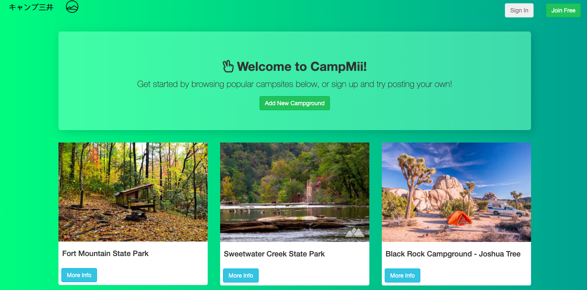
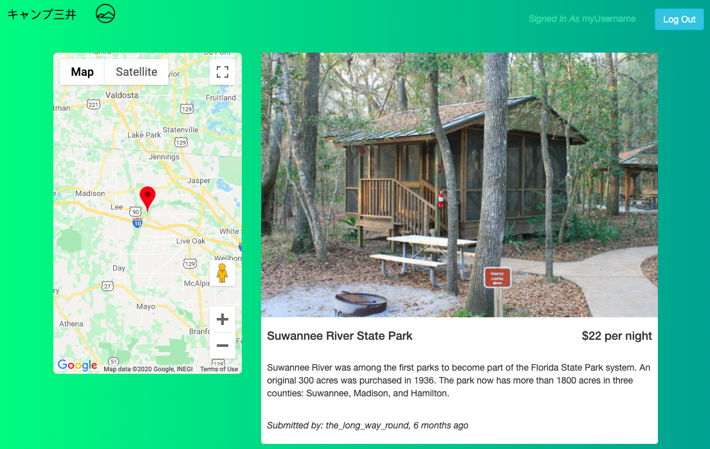
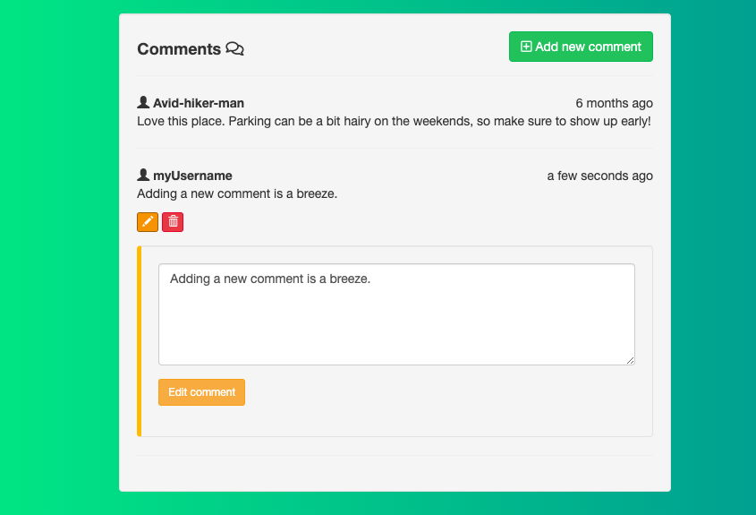

# Campmii 

Campmii is an application to share and explore campgrounds around the world. It's based off of the final code-along project in the Udemy Web Developer Bootcamp called YelpCamp. There were only so many features Colt could cram into a cheap bootcamp, so I decided to take over where he left off with YelpCamp and make it something of my own.

In hindsight, this project is poorly structured, prone to bugs, and utilizes outdated technologies. If I were to redo this project there would be many things I would alter. With all that being said, I am still proud of what I created.

Enjoy!



## Getting Started

You should only bother cloning and setting up this project if you have the patience to install MongoDB and setup a database. Visit http://www.campmii.com for the easy solution to viewing the end-product.

### Installing

Clone this git repo and install all dependencies:

```
npm install
```

### Running

Run the local node process. Since there are no default environment variables included in this repo, it should look for a local MongoDB database. This should already be running on `mongodb://localhost/camp-mii` prior to executing the following:

```
node app.js
```

Campmii is currently being hosted on Heroku with a custom domain name and the database is using MongoAtlas, a cloud-based database service. but you can still clone and modify it in your local environment.

## Mobile Design

Campmii was designed with mobile use in mind. There were plenty of design components that lent well to being shared between mobile and desktop. There were a few compromises talked about below, but for the most part Bootstrap made implementing mobile pretty easy.


## Desktop

Some features are disabled on the mobile site, such as the embedded google maps window shown below. This design choice was made because there simply wasn't enough real estate on the mobile screen to show it all.



Campmii supports a somewhat rich comment system. Comments can only be made if a User is logged in. A user can also edit/delete their own comments, but they must also be logged in.



## Built With

- [Node.js](https://nodejs.org/en/) - JavaScript runtime environment
- [Express.js](https://expressjs.com/) - Web application framework running on Node.js
- [Passport.js](http://www.passportjs.org/) - Authentication middleware for Node.js
- [Bootstrap](https://getbootstrap.com/) - Front-end toolkit for styling
- [EJS](https://ejs.co/) - [hard to use and outdated] Embedded JavaScript templating
- [MongoDB](https://www.mongodb.com/) - NoSQL Database
- [Heroku](https://www.heroku.com/) - Cloud application service used to host CampMii

## Versioning

I use [SemVer](http://semver.org/) for versioning. For the versions available, see the [tags on this repository](https://github.com/balbyu/campmii/tags).

## License

This project is not licensed.

## ❗️Thanks to Colt Steele for the coursework❗️
